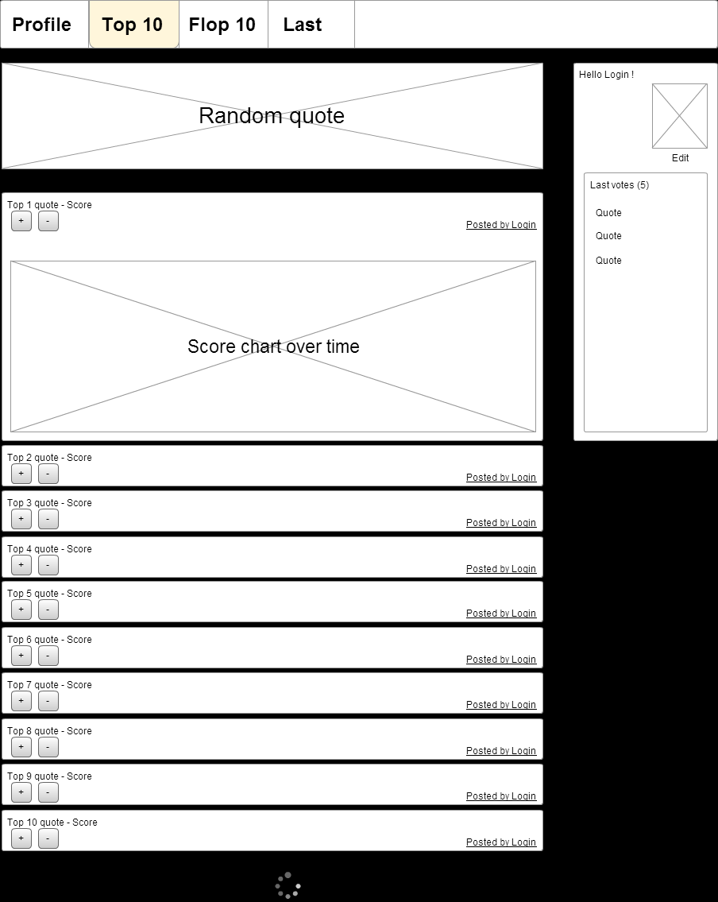

## About the project:  
REST Api for interacting with quotes.  
The user can create and edit a quote made by himself.
Also user can react to other user's quotes upvote or downvote.  



### To start the container from docker-compose :
```dockerfile
docker-compose up
```

### To build a Docker image :
```dockerfile
docker build -t app_quotes:1.0.0 .
```

### To run a Docker container :
#### In interactive mode:
```dockerfile
docker run -p 8080:8080 app_quotes:1.0.0 -it
```

#### In background mode:
```dockerfile
docker run -p 8080:8080 app_quotes:1.0.0 -d
```

### To view the Swagger documentation :  
[http://{app.host}:{app.port}/swagger-ui/index.html](http://{app.host}:{app.port}/swagger-ui/index.html)
